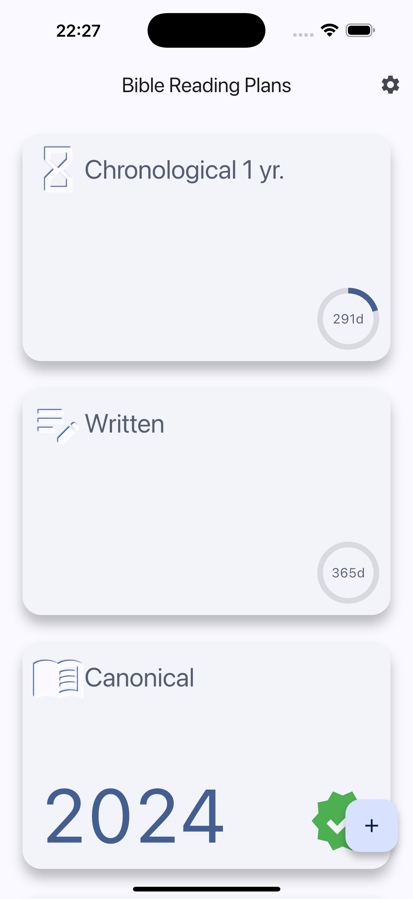
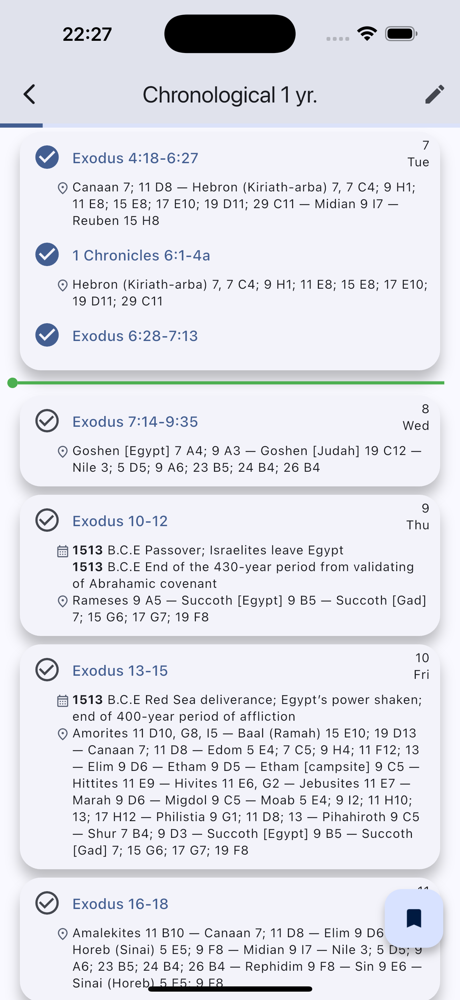
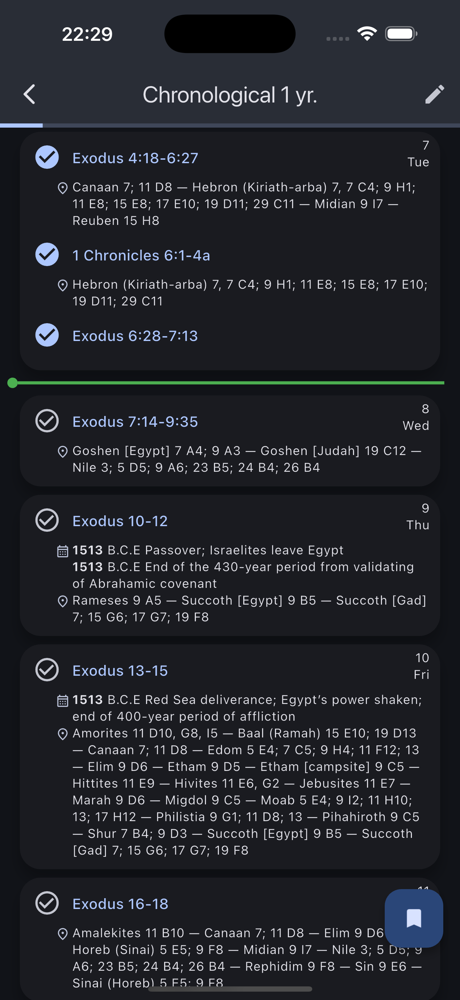
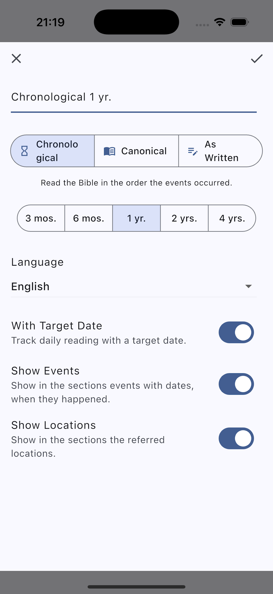
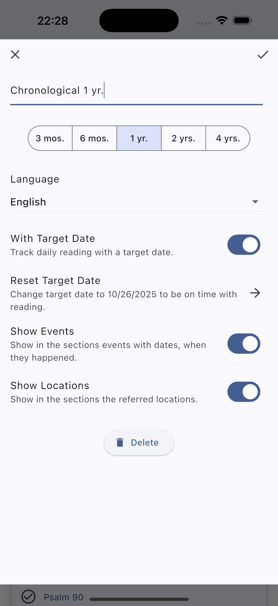
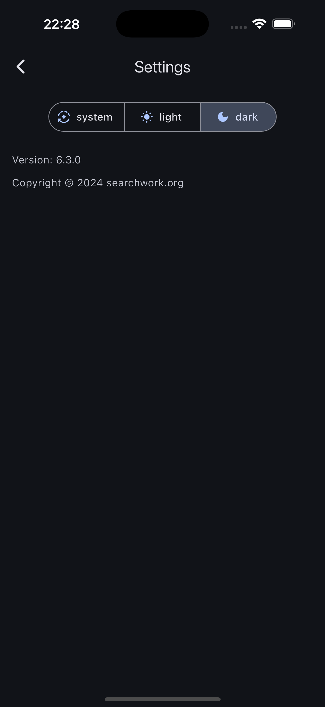

# NWT Reading

NWT Reading provides a Bible reading schedule for the New World Translation of the Holy Scriptures, specifically for Jehovah's Witnesses.

## Features

- Supports reading the Bible in all available languages of the complete New World Translation, including sign languages.
- Scriptures open in the JW Library® app.
- Tracks your reading progress and shows the number of days you are ahead or behind schedule.
- Offers several reading plans: canonical, in the order the Bible books were written, and chronologically, as the events took place.
- Allows you to select the reading speed or read without a specific end date.
- Highlights dates with key events in the chronological plan.
- Shows locations mentioned in each section and where to find them in the brochure “See the Good Land.”
- NEW: Use multiple Bible reading plans in parallel.
- NEW: Enjoy a dark mode theme for a more comfortable reading experience.
- NEW: NWT Reading is now open source! Find us on GitHub and contribute.
- User interface available in Czech, English, French, German, Hungarian, Italian, Polish, Portuguese (Brazil), Romanian, Russian, and Spanish.

JW Library is a registered trademark of the Watch Tower Bible and Tract Society of Pennsylvania.

## Screenshots

### Plans page

### Schedule page

### New and Edit Plan dialogs

### Settings page

