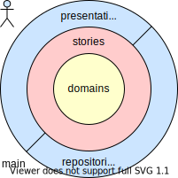

# Architecture

> **Dependency Rule**
>
> - Across architectural boundaries all dependencies point **inwards**, that is towards the entities (the business rules).
> - Inner rings must **not depend on outer rings**.
> - **Sections on the same ring** should not depend on each other. They may use each other indirectly through inner rings.

## Entities

The entities contain the application independent **business rules**.

The data **types** are exposed as [immutable classes] and the **objects** as [Riverpod] [AsyncNotifierProvider] objects called `<model>Provider` respectively `<model>FamilyProvider`.

[immutable classes]: https://dart.academy/immutable-data-patterns-in-dart-and-flutter
[Riverpod]: https://docs-v2.riverpod.dev
[AsyncNotifierProvider]: https://pub.dev/documentation/riverpod/latest/riverpod/AsyncNotifier-class.html

## Stories

The stories contain the user stories, that is **application specific business rules** (specific to the automation).

## Presentations

The presentation layer contains the **user interface** related objects.

## Repositories

Repositories assure **data access and persistence**. They are initialized following [this pattern][initialize].

[initialize]: https://codewithandrea.com/articles/riverpod-initialize-listener-app-startup/

## Unit Testing

The **AsyncNotifiers** are tested following [this pattern][unit test].

[unit test]: https://codewithandrea.com/articles/unit-test-async-notifier-riverpod
